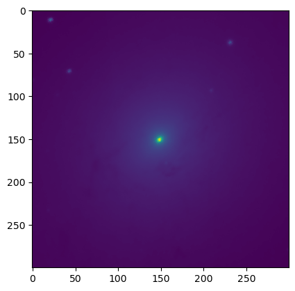
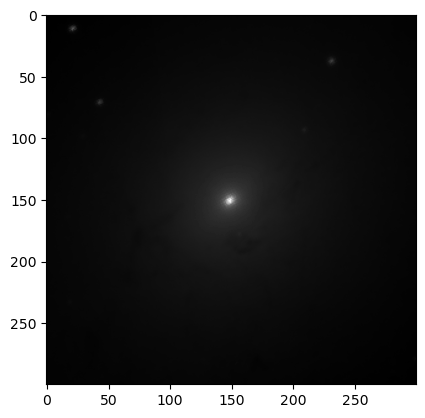
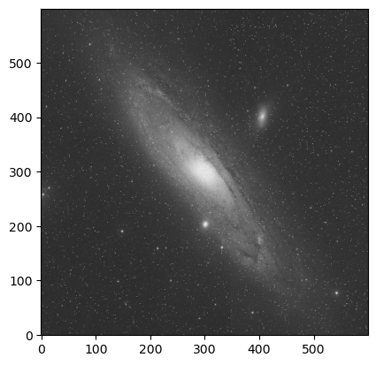
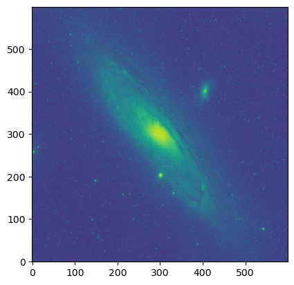
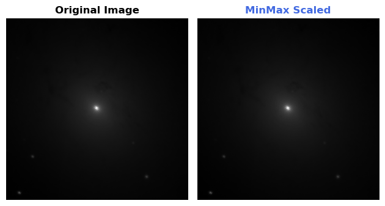
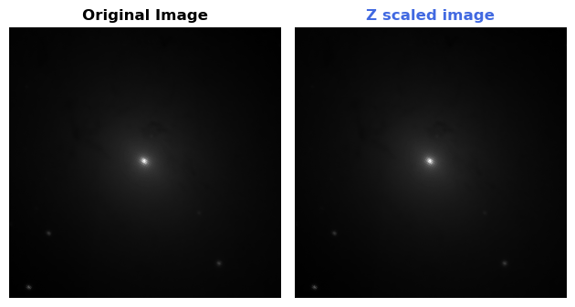
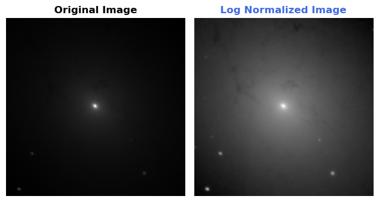
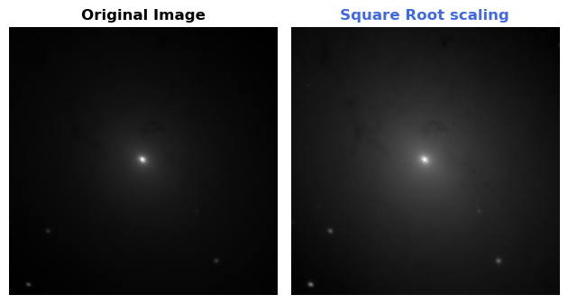
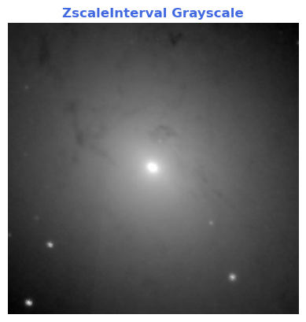

# M31 (Andromeda Galaxy) Astronomical Data Analysis

## M31 andromeda galaxy images from skyviewQuery Form. 
SkyView Query Form:- https://skyview.gsfc.nasa.gov/current/cgi/query.pl

## Pixel Scaling

### MinMax Scaling

### Z Scaling

### Log Normalization

### SquareRoot Scaling

### ZscaleInterval GrayScale
